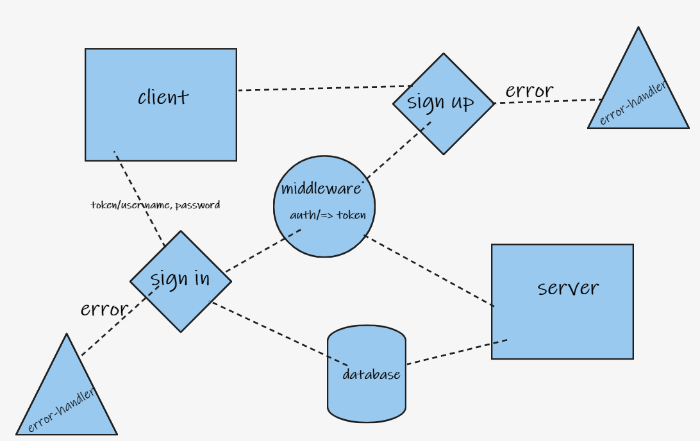

# bearer-auth

## description:
- a simple apo application to authorize user and to generate token and checking users

## features:
- base 64
- JWT

## UML
- 
## HEROKU:
- https://omars-bearer-auth.herokuapp.com/ 

## test: 
- Unit Tests: `npm test`